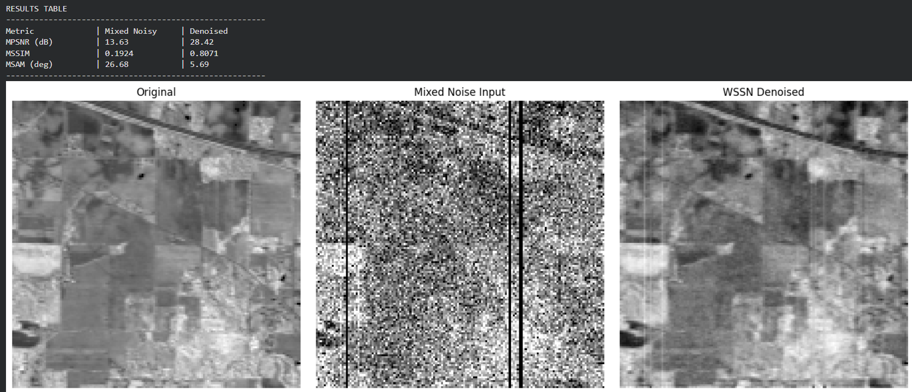
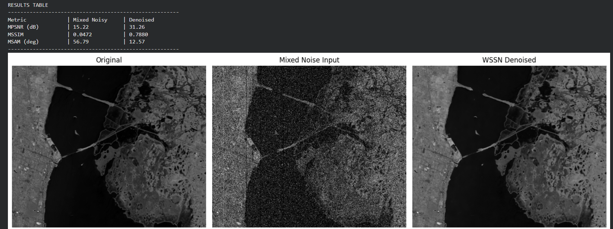
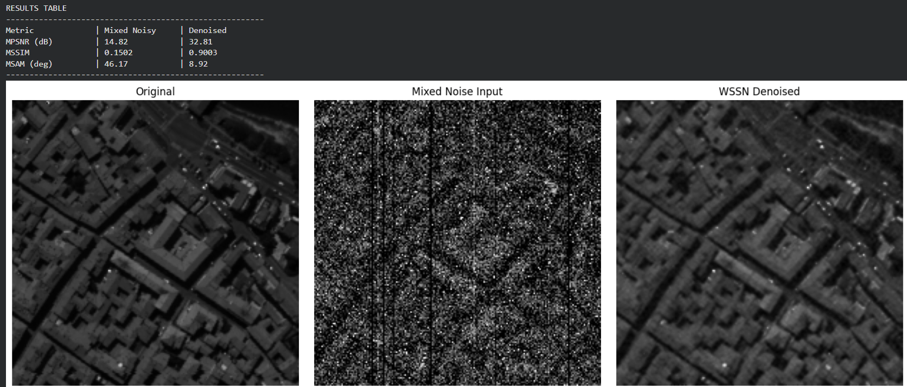
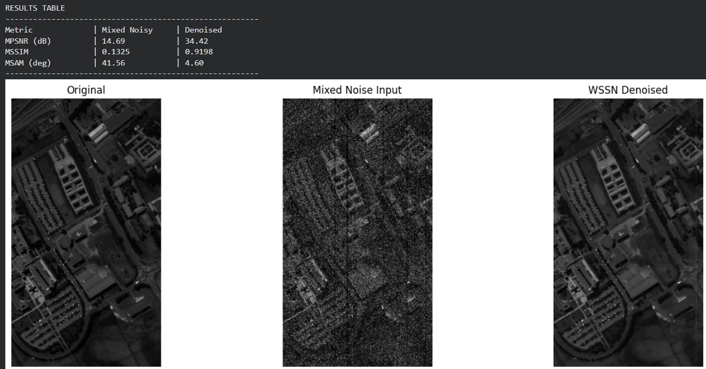
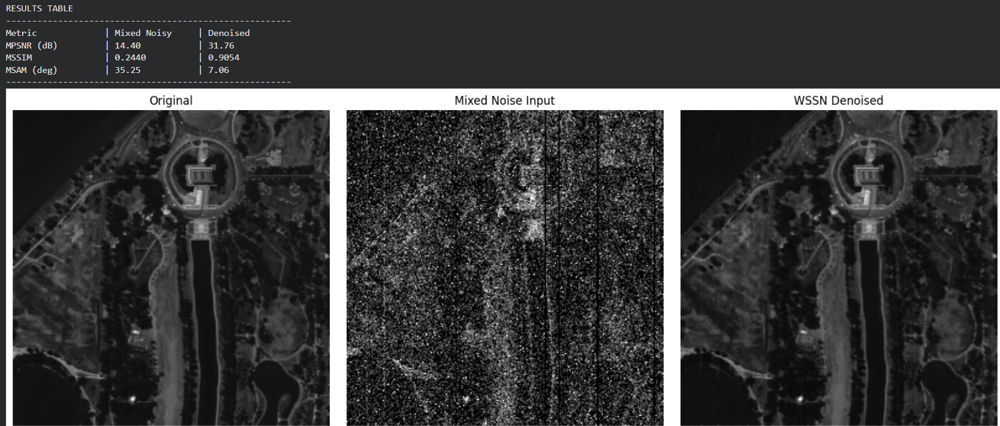

# SpectraClean: Hyperspectral Image Denoising

**SpectraClean** is a deep learning pipeline dedicated to the denoising of Hyperspectral Images (HSI). The project leverages a **Multi-level Wavelet Attention Network (MWAN)** implemented in PyTorch to effectively clean spectral data heavily corrupted by complex, mixed noise scenarios (e.g., Gaussian noise, impulse noise, dead lines, and stripes).

## Features
- **MWAN Architecture**: Uses Discrete Wavelet Transforms (DWT) for downsampling/upsampling and channel-wise attention to extract robust features from noisy spectral bands.
- **Subspace Projection**: Reduces data dimensionality and training time by projecting hyperspectral data into a lower-dimensional subspace using Singular Value Decomposition (SVD).
- **Mixed Noise Generation**: Built-in synthetic noise simulation that adds structural and random noise to rigorously test model robustness.
- **Automatic Mixed Precision (AMP)**: Speeds up model training and optimizes memory usage when a CUDA-enabled GPU is available.
- **Evaluation Metrics**: Tracks denoising performance using standard metrics:
  - Mean Peak Signal-to-Noise Ratio (MPSNR)
  - Mean Structural Similarity (MSSIM)
  - Mean Spectral Angle Mapper (MSAM)

## Methodology
Because hyperspectral images are highly correlated across spectral bands, **SpectraClean** first projects the data into a subspace using SVD. Following this projection, the noisy bands are passed to the MWAN model. MWAN uses a combination of channel-level attention and wavelet transforms to intelligently preserve valid signals while suppressing noise. Finally, the cleaned subspace representation is projected back into the original spectral dimension.

## Visual Results

Below are the denoising results on several standard hyperspectral benchmarks. The comparisons illustrate the Original Image, the Input Image corrupted by mixed noise, and the Cleaned Output from the MWAN model.

### 1. Indian Pines


### 2. Kennedy Space Center (KSC)


### 3. Pavia City


### 4. Pavia University


### 5. Washington DC Mall


## Getting Started

### Prerequisites
To use this project, ensure you have the following installed:
- Python 3.8+
- PyTorch
- NumPy
- Matplotlib
- scikit-image

### Usage
The complete pipeline is self-contained in a Jupyter Notebook. To run the project:
1. Clone the repository.
2. Launch Jupyter Notebook or JupyterLab:
   ```bash
   jupyter notebook spectra_clean.ipynb
   ```
3. Update the dataset paths in the final cell of the notebook to point to your `.npy` hyperspectral datasets (e.g., `indianpinearray.npy`, `PaviaU.npy`).
4. Run the cells to train the network, apply denoising, and evaluate the metrics!
